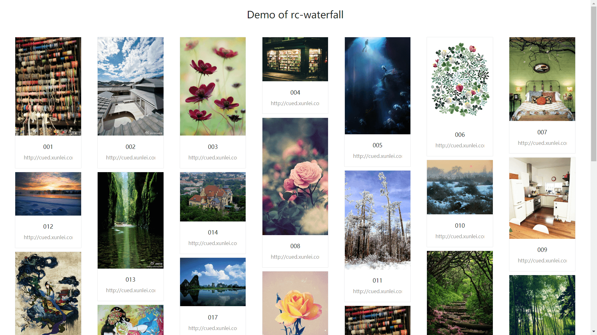

# rc-waterfall
[](https://travis-ci.org/liujian10/rc-waterfall)



## Install

[](https://npmjs.org/package/rc-waterfall)

## Development

```bash
# install
npm install --save rc-waterfall

# run
npm run dev

# build
npm run build
```

## Example

local: http://localhost:3002/

online: http://mapleliu.com/rc-waterfall/

## Usage [demo](./demo/Demo.js)

```js
import Waterfall from 'rc-waterfall';
```

## API

| 参数 | 说明 | 类型 | 默认值 | 可选值 |
|-----------|-----------|-----------|-------------|-------------|
| source | 图片资源列表 | array<string> | - | - |
| columnWidth | 单列宽度【单位px】 | number | 210 | - |
| isOnlyImg | 是否只根据图片高度进行排版 | boolean | false | true,false |
| renderItem | 渲染瀑布流块元素,回调参数【图片在列中位置ci:number,图片在source中位置si:number,图片url:string】 | function(ci,si,url):ReactNode | (ci,si,url)=>`` | - |
| getTarget | 设置需要监听其滚动事件的元素，值为一个返回对应 DOM 元素的函数 | function():HTMLElement | ()=>window | - |